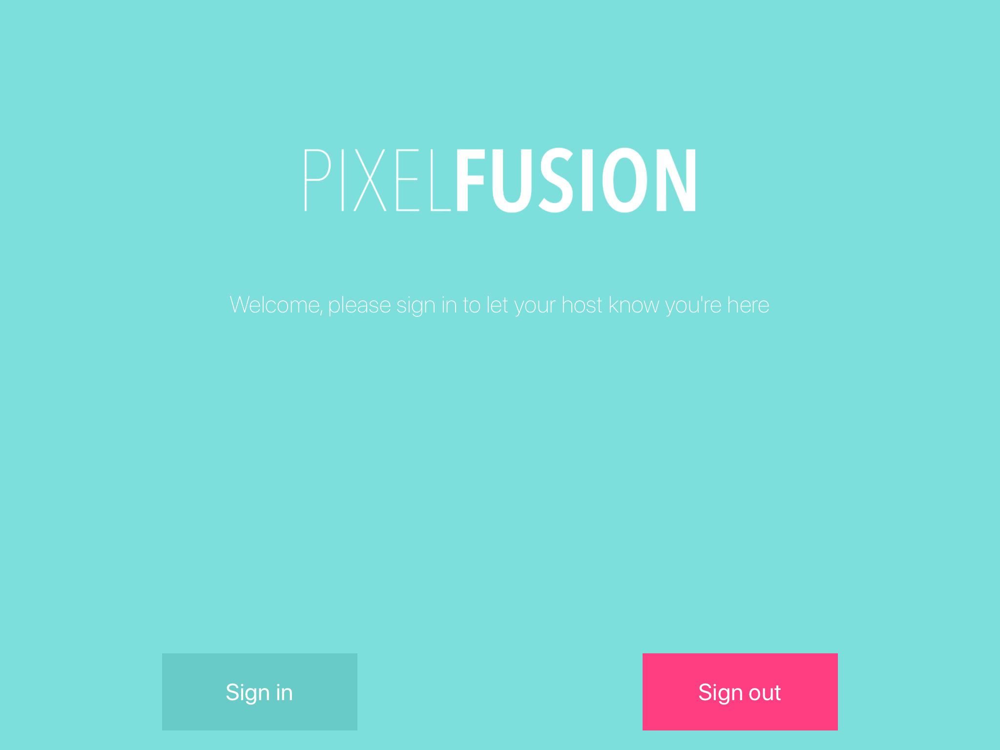

Here at Pixel Fusion, the products we have created up to this point are mostly based in the web space. Dashboards, websites, chatbots, you get the idea. For most of our products that require an interface, React has quickly become our platform of choice. It has a rich eco-system of developers and libraries, allowing us to create robust and performant products very fast, even with our relatively small team.

Although mobile apps have become part of the woodwork in the digital landscape, it's not something we've ever done before. As part of our always learning mantra, we decided we would expand on that by utilising our existing React skills in our first React Native application.

## The Project

The project we decided to apply this to was our office's visitor sign-in app. Currently, we have a webpage open in an iPad on the studio manager's desk where people come and sign in. Since we're a leading digital solutions company, we thought we could do a little better than this. 

Without little or no time for this project, we started out by deciding our core technologies:

- React Native with Redux for the client
- NodeJS to build our services
- MongoDB as a database
- AWS Lambda (and later potentially ECS) to run those services
- GraphQL for speaking between the client and our services. This was a decision we made a little later in the project, but I’ll get to that later
Getting set up

The brilliant community that drives the React ecosystem had our first solution, ready and waiting. create-react-native-app was what we would use for getting our app off the ground, and from there, everything “just worked”. Our linters plugged in seamlessly, and our existing IDEs were all ready to go.

Running it in a simulator and on a device it’s was also really straightforward, with the documentation being clear and easy to follow. Bundling everything in production mode was little more involved, but it’s something that could set up within a build pipeline without too much effort. 

## Javascript on devices
We implemented Redux in the exact same way we have in the past, the only major difference so far was the fact we had to use JSX tags provided by the react-native library. Attaching `onClick` events on any old element wasn’t going to work, but react-native provides touch handling wrappers to provide UI input. If this was to be compiled to HTML we could argue semantics, but no such issues here. 

Managing our routes was also a key difference, as on an iPad there are no URLs or history API. The most prolific solution we found was react-navigation, which has good Redux support and provided native route change animations. Getting our heads around it was a little interesting, for instance `back()` in an app is different to `back()` in a browser. Once we recognised how the page (screen?) flow went, it was really smooth sailing. 

## Writing CSS without CSS
Styling is a bit murky in React Native. Applying the styles using the `Stylesheet` helper function quickly slowed our development time, as CSS properties don’t line up 1-to-1 with browsers and our awesome linters were useless. 


*Our Atomic Design structure didn’t suit using styled-components*


We had heard a lot about `styled-components` and we decided to try it. Although it doesn’t quite fit our "flavour” of Atomic Design, it sped our development time up hugely. We could use CSS straight from the browser, and Atom was able to lint the components. Although this was a lot nicer than having to write style properties as part of a javascript object, things we take for granted in CSS such as nesting and inheritance were more complicated, so that’s something we’ll continue to develop going forward with React Native.

Here’s an example of how a component looks:

```javascript
// src/styled/styled-input.js
import * as COLOURS from '../config/colours';
import styled from 'styled-components/native';

export const StyledInput = styled.TextInput`
    padding: 12px;
    font-size: 18px;
    background-color: ${COLOURS.LIGHT};
    border: 2px solid ${COLOURS.LIGHT};
    border-radius: 4px;
    border-left-color: ${(props) => {
        return props.error ? COLOURS.SECONDARY : COLOURS.LIGHT;
    }};
`;
```

## Our “server” side logic
As we began looking to integrate our new app with a server, we thought how we could solve it on our limited time and budget. We decided on using GraphQL on top of Node, as it would mean faster development with less boilerplate and a simpler server architecture. Since it’s a super thin application, we can run everything as a Lambda function behind API Gateway, which is secure, fast and inexpensive. 

We used MongoLab’s database-as-a-service for any persisted data. This was really a key part that allowed us to use Lambda, as nothing needs to be persisted on the service level. 

We set up the Node service using Docker, which let us replicate the Node 6.10 environment Lambda uses. Then we simply had two wrappers for the same application, `server.js` as a simple Express server, and `handler.js` for Lambda. This got around the tricky situation of developing and testing locally, and also makes it easy to use in a container service such as Amazon ECS. 

```javascript
// server.js
const app = require('./app');
const PORT = 5000;

app.listen(PORT, () => console.log(`Listening on http://localhost:${PORT}`)); 
```

```javascript
// handler.js
const app = require('./app');
const awsServerlessExpress = require('aws-serverless-express');
const autologoutTask = require('./tasks/auto-logout');

const server = awsServerlessExpress.createServer(app);

exports.graphql = (event, context) => awsServerlessExpress.proxy(server, event, context);
exports.autologoutVisitors = (event, context, callback) => autologoutTask(callback);
```


##Conclusion and next steps


*The final product*


We proved that we could build native applications at, or close to, the level we build browser-based products. Having our typical React stack up and working made it very easy to port over techniques we had already established. Anybody with React experience could pick this project up and work on it with very little problems. 

Our next step for this will to be to add some facial recognition (most likely using Amazon Rekognition) and automate as much of the process as possible for return visitors.
