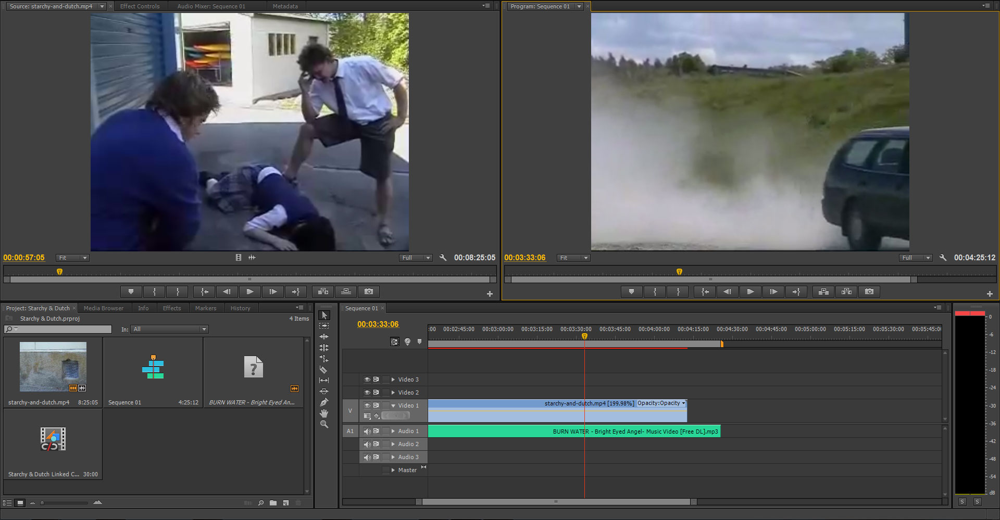

I recently rediscovered my old Year 12 Media Studies assignment on Youtube. It was recorded on tape, which somehow corrupted and the audio didn't match the video. It didn't have a storyline. It was trying to rip off a great 70's TV show. Its actors&nbsp;(including yours truly), director and cinematographer didn't take it seriously. Needless to say it's pretty much unwatchable.

<iframe style="display: block; margin-left: auto; margin-right: auto;" src="http://www.youtube.com/embed/BQlxVcmTrx8" width="420" height="315" frameborder="0"></iframe>

Why not turn some horrible piece of almost film into [Oscar Wilde's definition of art]{:target="_blank"}. If you want to turn your awful old high-school assignment into something a little bit more workable, follow these steps:

###Tools and materials
To edit this, I'll be using Adobe Premiere Pro and Adobe After Effects, and since the video is a ridiculously low 320x240, I won't need a lot computing power. I may or may not have had to break YouTube's Terms of Service to get my hands on the video, and for audio, go find yourself a cool artist on Soundcloud and try to get your hands on one of their songs. I chose the one below because it feels really nostalgic and creates a cool mood. Things like fonts and images are completely up to you. ART.

<iframe style="display: block; margin-left: auto; margin-right: auto;" src="https://w.soundcloud.com/player/?url=https%3A//api.soundcloud.com/tracks/68551882&amp;auto_play=false&amp;hide_related=false&amp;visual=true" width="100%" height="450" frameborder="no" scrolling="no"></iframe>

### Composition

Editing the video to make it workable is very easy.

1. Open up PP and import the video into a new sequence.
2. Remove all sound from the original video.
3. Set the video speed to double what it was recorded at to make up for all those dropped frames and overly long shots, and so it's not 8 minutes long.
4. Save the video.
5. We're done with composition. ART.

It doesn't much easier than that.

### Add "Artiness"

Now get that sequence that we've already made 50x better and open it in AE, and import your hipster song. Put the song over the video and play around to get them the about same length. Right-click the sequence, go to Effects -> Color Correction -> Black & White to add that old favourite of wannabe film-makers, black and white. Next, we'll add a new solid and follow [this tutorial] to give the video an arty light strobe effect. ART.

<!--<h2>Optional Extra</h2>
<h3>Dialogue</h3>
The video is now art but it isn't compelling watching. Since this video already looks like it was shot before decent audio recording, I went ahead and added a ton of subtitles. This meant I could what the actors were saying and try add some sort of a plot. Of course since we sped up the video so much, there isn't much time to show the message on screen during scenes with a lot of dialogue. I opted to roll each line onto the screen similar to how messages come up on iMessage. This took ages but it had to be done.
-->

### Voila, Art

Congratulations, if you have followed all my steps you will have a hipster video to show your old classmates.&nbsp;

<iframe src="http://player.vimeo.com/video/89825365" width="500" height="375" frameborder="0"></iframe>

[Oscar Wilde's definition of art]: http://quotes.lifehack.org/quote/oscar-wilde/all-art-is-quite-useless/
[this tutorial]: https://www.youtube.com/watch?v=tBewECMyLG0
